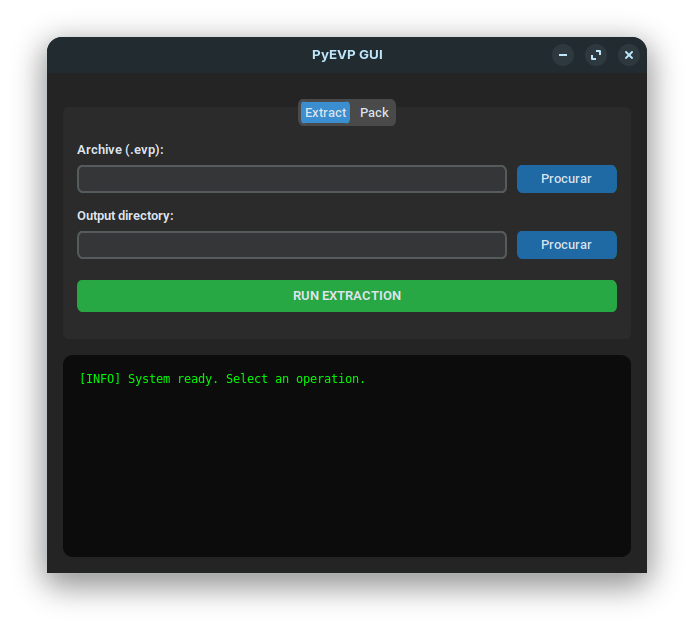

# PyEVP_GUI

Utilitário de desenvolvimento voltado à manipulação de pacotes de dados do cliente Talisman Online. A ferramenta permite a compactação e descompactação de arquivos com extensão `.EVP`, facilitando o acesso a recursos internos do jogo, como texturas, modelos e configurações, para fins de edição ou tradução.

## Captura de Tela



## Instalacão (Desenvolvimento)

Instale a lib a partir do release publicado pelo repositório [pylibevp](https://github.com/eudivanmelo/pylibevp):

```bash
python -m pip install --upgrade "https://github.com/eudivanmelo/pylibevp/releases/download/v0.1.0/pylibevp-0.1.0-py3-none-any.whl"
```

Depois instale as dependencias da GUI:

```bash
cd ../pyevp_gui
pip install -r requirements.txt
```

## Executar

```bash
python run.py
```

## Release automático no GitHub Actions

Ao publicar mudanças na branch `main`, o workflow `.github/workflows/release-linux.yml` gera um executável Linux com PyInstaller, empacota em `tar.gz` e cria uma prerelease no GitHub com o artefato anexado.